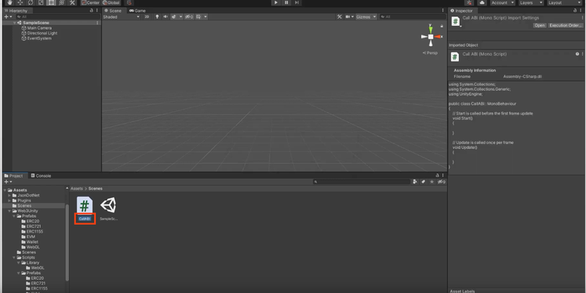
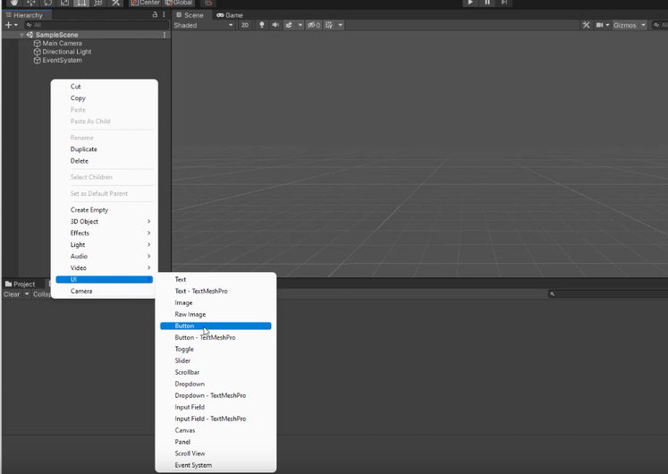
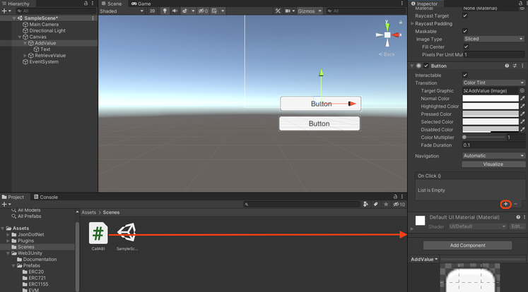
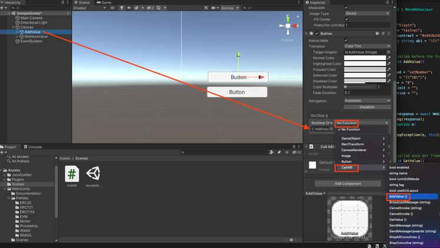
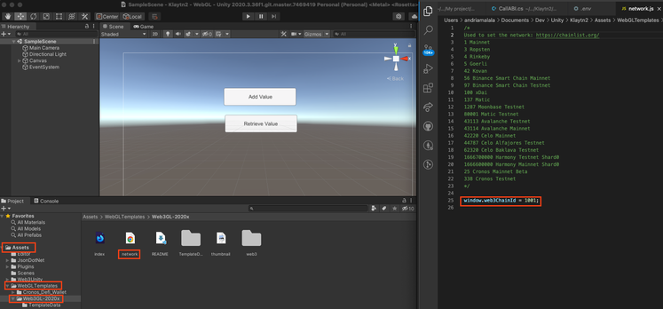
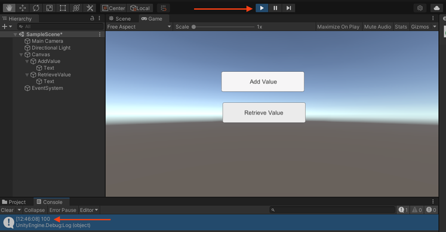
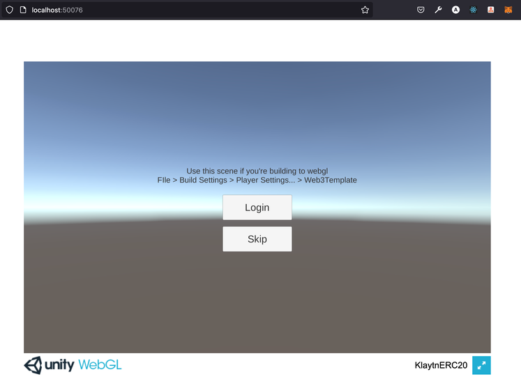
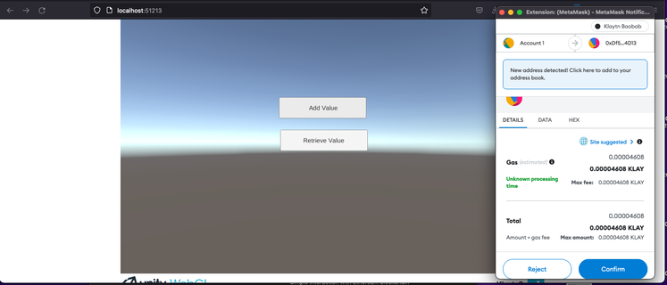

# Custom Interaction with Login <a id="Custom Interaction with Login"></a>

In this section you will see how to build a Unity project with a login button to connect a web3 wallet and two other buttons to write and read the contract.


## Getting Started <a id="Getting Started"></a>

Start by creating a new project by following the steps at the section [Create a new Unity project](./create-a-new-unity-project.md).
Make sure to install all dependencies to fix all bugs.

**Use the WebLogin prefab to enable web3 wallet connection**

Under **Assets** → **Web3Unity** → **Scenes**, double-click on **WebLogin**. This is the prefab used to connect a wallet in a WebGL project.


Go to **File** → **Build Settings** → **WebGL** → **Switch Platform**


From the same window, click on **Add Open Scenes** (top right) to add the Login scene as the first scene to appear when we run the project.

From the same window, click on **Player Settings** → **Player** → **Resolution and Presentation**, under **WebGL Template**, select the one with the same as our Unity version (WebGL 2020 for our case).


Go back to the Unity project. Under **Assets**, select **Scenes** and double-click on **SampleScene** to use it as our second scene (FYI the first one is the login scene).

Go to **File** → **Build Settings** → **Add Open Scenes**. The SampleScene will appear under the WebLogin scene. It means the SampleScene, where we will create the buttons to read and write to the contract, will be the next scene after the *WebLogin*. 

> Make sure the WebLogin scene is at the top because the order matters.


## Create your Contract <a id="Create your Contract"></a>

* Open Remix IDE, install the Klaytn Remix plugin then paste the code below:

```javascript
// SPDX-License-Identifier: MIT
pragma solidity ^0.8.0;

contract Storage { 

    uint256 number;

    function store(uint256 num) public {
        number = num;
    }

    function retrieve() public view returns (uint256) {
        return number;
    }
}

```

* Compile your contract and deploy it to baobab testnet (get your faucet [here](https://baobab.wallet.klaytn.foundation/faucet)).


## Create your C# script on Unity <a id="Create your C# script on Unity"></a>

Under **Project** window, right-click on **Scenes**, click on **Create** → **C# Script**


Rename it (here we’ll use the name `“CallABI”`)



Double-click on the script to open it. Complete the `script` with the information below:

```javascript
using System.Collections;
using System.Collections.Generic;
using UnityEngine;
using System;

public class CustomCallABIExample : MonoBehaviour
{

    // set chain
    string chain = "klaytn";
    // set network
    string network = "testnet";
    // set contract address
    private string contract = "0xDf5A1aAa8C1E6a7b4e42dA606Ed8e43BeF764D13";
    // set contract ABI
    private readonly string abi = "[{\"inputs\":[{\"internalType\":\"uint256\",\"name\":\"num\",\"type\":\"uint256\"}],\"name\":\"store\",\"outputs\":[],\"stateMutability\":\"nonpayable\",\"type\":\"function\",\"signature\":\"0x6057361d\"},{\"inputs\":[],\"name\":\"retrieve\",\"outputs\":[{\"internalType\":\"uint256\",\"name\":\"\",\"type\":\"uint256\"}],\"stateMutability\":\"view\",\"type\":\"function\",\"constant\":true,\"signature\":\"0x2e64cec1\"}]";
    // set RPC endpoint url
    string rpc = "https://public-node-api.klaytnapi.com/v1/baobab";

    // Call the "store" function with "10" as argument
    async public void AddValue()
    {
        // contract function 
        string method = "store";
        // argument
        string args = "[\"10\"]";
        // value in ston (wei) in a transaction
        string value = "0";
        // gas limit (OPTIONAL)
        string gasLimit = "";
        // gas price (OPTIONAL)
        string gasPrice = "";

        try 
        {
            string response = await Web3GL.SendContract(method, abi, contract, args, value, gasLimit, gasPrice);
            Debug.Log(response);
        } catch(Exception e) 
        {
            Debug.LogException(e, this);
        }
    }

    // Call the retrieve function
    async public void GetValue()
    {
        // contract function
        string method = "retrieve";
        // arguments
        string args = "[]";
        try
        {
            string response = await EVM.Call(chain, network, contract, abi, method, args, rpc);
            Debug.Log(response);
        } catch(Exception e) 
        {
            Debug.LogException(e, this);
        }
    }
}

```

## Create the buttons <a id="Create the buttons"></a>

Right-click on the scene, click on **UI** → **Button** and rename it to *AddValue* and *RetrieveValue*



To interact with the buttons:

1. Click on **AddValue** button from the Hierarchy window
   
2. Drag the *CallABI* script into the right window
   
3. Add an *On Click()* function by clicking on the ➕ button



4. Drag the **AddValue** button from Hierarchy window into the *On Click()* function
   
5. Click on **No Function** → **CallABI** → **AddValue()**



For the **RetrieveValue** button, redo the steps from step 1 to step 5 above, but instead of selecting **AddValue**, select **RetrieveValue**.

Edit the network *chainID* under **Assets** → **WebGLTemplates** → **Web3GL-2020x** → **network.js**. Set the `window.web3ChainId` to *1001*.




To test the *Retrieve Value* function, click on play ▶️ and click on *Retrieve Value*



To test the *Add Value* function , click **File** → **Build and Run**. You will have a new window in the browser that will show you the login interface.




Click on **Login** to connect to Metamask.

Click on **Add Value** to add the value of 10 to the contract.

Confirm your transaction on Metamask and voilà ! Your transaction is sent to the network.




