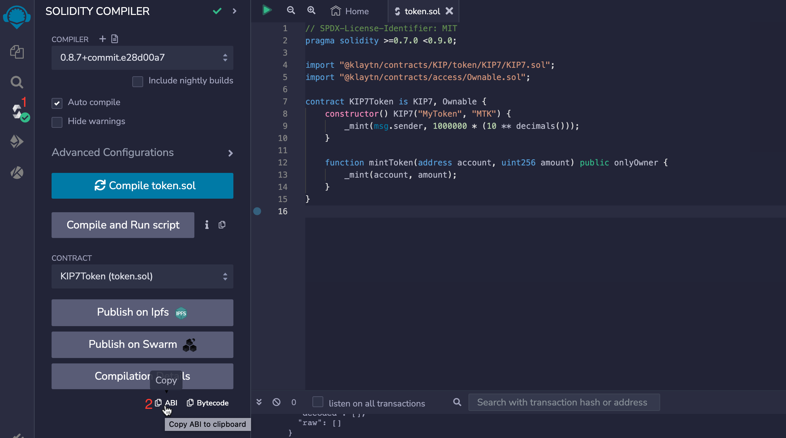

# KIP7 Tutorial

KIP7 contracts is an implementation of fungible tokens on Klaytn. These contracts can either be deployed and interacted with using Remix IDE or in your local development environment. After the deployment of contracts, you ll need to interact or call its functions. Klaytn provides developers with a javascript library: [caver-js](https://docs.klaytn.foundation/content/dapp/sdk/caver-js), to interact with Klaytn node and also with smart contracts on Klaytn.

Caver-js requires contract ABI and contract address to interact with smart contract and for the purpose of this tutorial we would make use of Remix IDE to quickly and easily generate ABI and contract address. At the end of this tutorial, you'll be able to interact with an already deployed KIP7 contract using caver-js.

# Prerequisite <a id="KIP7 Tutorial Prerequsite"></a>

* [Remix IDE](https://docs.klaytn.foundation/content/dapp/tutorials/connecting-remix#connecting-klaytn-remix-using-kaikas) and [Kaikas](https://kaikas.zendesk.com/hc/en-us/articles/6657796272793-How-do-I-install-PC-Kaikas-)
* Enough test KLAY from [faucet](https://baobab.wallet.klaytn.foundation/faucet)
* [Node Js and NPM](https://kinsta.com/blog/how-to-install-node-js/)

In this tutorial, you will learn how to deploy a KIP7 smart contract and interact with the deployed contract. Smart contracts must already be deployed on the blockchain i.e you must have the smart contract address and ABI. In a little while, we would go through deploying the contract using Remix IDE.

# Deploying KIP 7 Smart contract <a id="Deploying KIP 7 Smart contract"></a>

The contract below defines a basic KIP7 token with the name "MyToken", the symbol "MTK", and 18 decimal places. The contract uses the KIP7 contract from the [Klaytn contracts library](https://github.com/klaytn/klaytn-contracts). The initial supply of the token is set in the contract's constructor, where we are minting 1 million tokens and sending them to the contract's creator. The mintToken function allows you to mint a certain amount of token to an address.

```javascript

// SPDX-License-Identifier: MIT
pragma solidity >=0.7.0 <0.9.0;

import "@klaytn/contracts/KIP/token/KIP7/KIP7.sol";
import "@klaytn/contracts/access/Ownable.sol";

contract KIP7Token is KIP7, Ownable {
    constructor() KIP7("MyToken", "MTK") {
        _mint(msg.sender, 1000000 * (10 ** decimals()));
    }

    function mintToken(address account, uint256 amount) public onlyOwner {
        _mint(account, amount);
    }
}

```

Refer to this [guide](https://docs.klaytn.foundation/content/dapp/tutorials/connecting-remix#connecting-klaytn-remix-using-kaikas) to deploy the above contract on Klaytn using Remix IDE.

After you have successfully deployed your token contract, you should be able to copy the contract’s ABI and address as shown in the below pic as reference. 




# Installing Caver-js <a id="Installing Caver-js"></a>
In order to make use of caver-js, you need to create a new folder in your local directory. After this folder has been created, you ll need to install caver -js. 

open a terminal window and run the command below to install caver-js

> npm init -y

> npm install caver-js

# Interacting with KIP7 smart contract functions <a id="Interacting with KIP7 smart contract functions"></a>
In order to interact with deployed contracts using caver-js, you will need to follow these steps.

**a. Set up ABI folder**

Create a new folder named abi  in your project directory. Inside this new folder, create a new file named `kip7Abi.json`. Paste the contract ABI into this newly created file.

**b. Create your Scripts**

Create a folder named scripts in your project directory. Inside this new folder, create a new file named `kip7Caver.js`. 

**c. Execute Scripts**

Paste the code below in your newly created `kip7Caver.js` file. This code illustrates the use of caver.js to interact with the KIP7 token previously created.

First, we import caver.js and the contract ABI, which defines the functions and parameters of the KIP7 contract. Then, we initialize caver.js and the KIP7 contract by providing the contract address.

Next we set the contract address, create and add keyring to enable users sign on using their own Klaytn account. Then, we call a balanceOf function to get a specified address token balance. Then, we minted 100000 tokens to a  specified account given the sender of this transaction is the creator of the contract. Finally, we transfer 500  tokens from the current account to another account using the `transfer` function of the contract.

```javascript
// Interact with KIP7 contract with caver-js

// Import caver.js and the KIP7 contract ABI
const Caver = require('caver-js')
const contractABI = require("../abi/kip7Abi.json")

// Initialize caver.js and the KIP7 contract
const caver = new Caver('https://api.baobab.klaytn.net:8651/')
const contractAddr = “paste contract address here”
const contract = caver.contract.create(contractABI, contractAddr);

// Create and add keyring
const keyring = caver.wallet.keyring.createFromPrivateKey(‘paste’ private key here)
caver.wallet.add(keyring)

// function to get token balance
const  getTokenBalance = async (addr) => {
    contract.methods.balanceOf(addr).call()
    .then(result => {
        console.log(result);
    })
 }

// function to mintTokens 
const mintTokens = async () => {
    const recipientAddr = “paste “recipient address;
    const mintAmount = 100000;
    contract.send({from: keyring.address, gas: 1500000, value: 0}, 'mintToken', recipientAddr, mintAmount)
    .then(receipt => {
        console.log(receipt);
        getTokenBalance(recipientAddr);
    })
    .catch(err => {
        console.log(err);
    })

}

// function to transfer tokens
const transferTokens = async () => {
    const recipientAddr = “specify recipient address”;
    const transferAmount = 500;

    const recipientBalanceB4 = await contract.methods.balanceOf(recipientAddr).call();
    console.log(recipientBalanceB4);

    contract.send({from: keyring.address, gas: 1500000, value: 0}, 'transfer', recipientAddr, transferAmount)
    .then(receipt => {
        console.log(receipt);
        getTokenBalance(recipientAddr);
    })
    .catch(err => {
        console.log(err);
    })

}
getTokenBalance(keyring.address);
// mintTokens();
// transferTokens();

```

To run this code, open your terminal and paste this command
> node ./scripts/kip7Caver.js.


